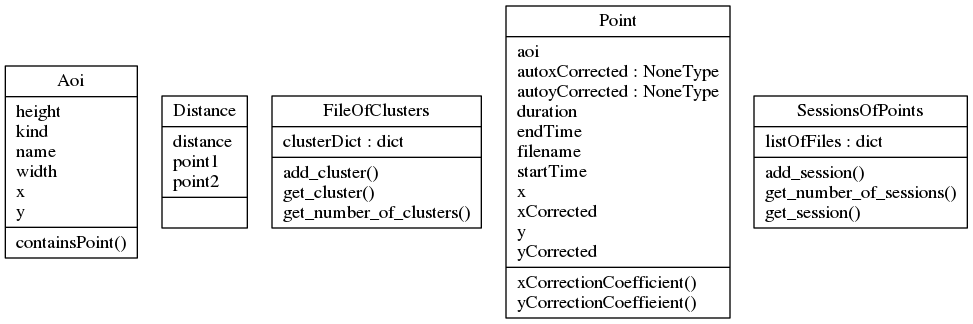

# fixation-correction-sourcecode
*Unless otherwise noted, files are in the root/source directory.*
### Debug files:
- test.txt
- cluster.txt
- correction_ratio.txt
- overflowlog.txt

### Input and Output folders:
- eyetracking-data/
- aoi-data/aoi-csv/
- corrected-aoi/

## How to use:
1. After cloning/downloading the source code initialize the required directories and files.

#### Files:
  - test.txt *a debug file in the source directory*
  - cluster.txt *a debug file with information about clusters being created*
  - correction_ratio.txt *a debug file with information about the performance of the automated correction with manual corrections*
  - overflowlog.txt *a debug file for information about queue overflows*
  
#### Directories:
  - eyetracking-data/ *a directory containing the original eyetracking csv files*
  - aoi-data/aoi-csv/ *a directory containing the related aoi information with matching filenames to those in the "eyetracking-data/" directory*
  - corrected-aoi/ *a directory where the results of running the program are put (corrected eyetracking csv files*
  
2. Run main.py in order to create corrected files from the original files:
  - The csv files that are used as input need to contain the following fields:
  
    - eyetracking-data:
        - fix_x_original
        - fix_y_original
        - duration_ms
        - start_ms
        - end_ms
        - aoi_sub.line
        - fix_x
        - fix_y
    - aoi-data/aoi-csv:
        - kind
        - name
        - x
        - y
        - width
        - height

### UML class diagram(s)
*this one was created using pyreverse an awesome tool that comes packaged with pylint*

